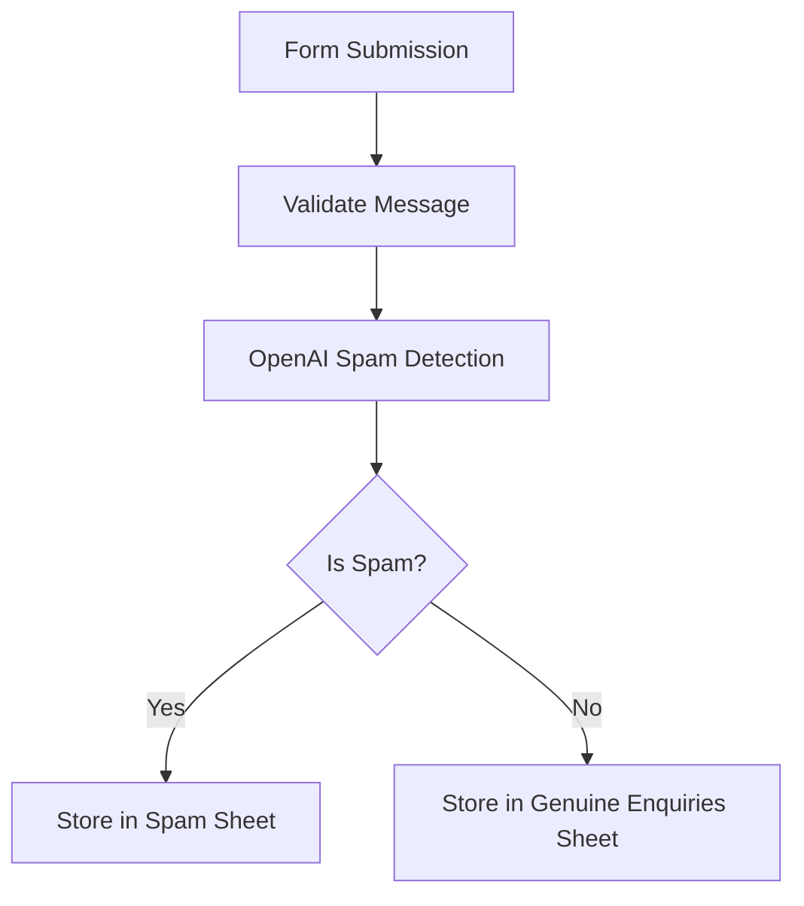

# 🚀 AI-Powered Lead Filtering Workflow (n8n)


---

## 📌 Overview

This project contains an **n8n workflow** that automates **lead intake, spam detection, and data organization** using AI.

It captures form submissions, classifies them using an OpenAI model, and stores them in the appropriate Google Sheets tab:

* ✅ Genuine Enquiries
* 🚫 Spam

---

## 🧠 Key Features

* 📥 **Form-based lead capture**
* 🤖 **AI-powered spam detection (GPT-4.1-mini)**
* 🔀 **Automated decision branching**
* 📊 **Google Sheets integration**
* ⚡ **Real-time processing**

---

## 🏗️ Workflow Architecture



---

## ⚙️ Workflow Breakdown

### 1. 📥 Form Trigger

* Captures:

  * Email
  * Message
* Entry point of the workflow

---

### 2. 🧹 Validation (Filter Node)

* Ensures message is not empty
* Prevents invalid submissions

---

### 3. 🤖 AI Classification

* Uses **OpenAI GPT-4.1-mini**
* Prompt-based classification:

  * `"yes"` → Spam
  * `"no"` → Legitimate

---

### 4. 🔀 Conditional Routing

* Uses IF node to branch logic:

  * Spam → Spam Sheet
  * Genuine → Enquiries Sheet

---

### 5. 📊 Data Storage

* Google Sheets:

  * **Spreadsheet:** Lead Enquiry Database
  * **Tabs:**

    * `Spam`
    * `Genuine Enquiries`

---

## 📂 Project Structure

```bash
.
├── workflow.json      # Exported n8n workflow
├── README.md          # Documentation
```

---

## 🚀 Getting Started

### 1. Install n8n

#### Option A: npm

```bash
npm install n8n -g
n8n
```

#### Option B: Docker

```bash
docker run -it --rm \
  -p 5678:5678 \
  n8nio/n8n
```

---

### 2. Import Workflow

1. Open n8n UI (`http://localhost:5678`)
2. Click **Import**
3. Upload `workflow.json`

---

### 3. Configure Credentials

You must set up:

#### 🔑 OpenAI

* Add API key in n8n credentials

#### 📊 Google Sheets

* OAuth2 authentication
* Ensure access to your spreadsheet

---

### 4. Setup Google Sheet

Create a spreadsheet:

**Name:** `Lead Enquiry Database`

#### Required Tabs:

* `Spam`
* `Genuine Enquiries`

#### Suggested Columns:

| Email | Message |
| ----- | ------- |

---

### 5. Activate Workflow

* Enable the workflow
* Start receiving and filtering submissions automatically

---

## 🔧 Customization

You can extend this workflow easily:

* ✉️ Send email alerts for new leads
* 💬 Integrate Slack/Discord notifications
* 🧠 Improve AI prompt for better filtering
* 🗄️ Replace Google Sheets with a database
* 📈 Add analytics dashboard

---

## 🔐 Security Best Practices

* Store API keys in environment variables
* Restrict webhook access
* Validate input fields
* Monitor execution logs

---

## 📈 Use Cases

* Lead generation systems
* Contact form filtering
* Freelance client intake
* Agency automation pipelines
* AI-powered CRM preprocessing

---

## 🛠️ Tech Stack

* **n8n** – Workflow automation
* **OpenAI API** – AI classification
* **Google Sheets API** – Data storage

---

## 🤝 Contributing

Contributions are welcome!

1. Fork the repo
2. Create a feature branch
3. Submit a pull request

---

## 📄 License

This project is licensed under the **MIT License**

---

## ⭐ Support

If you find this useful:

* Star the repo ⭐
* Share it with others 🚀

---
